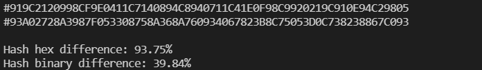
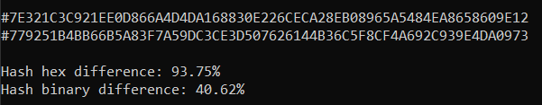
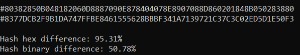
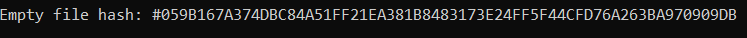

# 1-oji užduotis. Hash generatoriaus kūrimas.

## Hash funkcijos pseudokodas
    string hashfunc(string input, int n):
        string hash_val="";
        int tarp=0;                     // kintančios tarpinės reikšmės
        int a = int(input[0])/2; 
        while(hash_val.length()<64){    // ciklas kartojamas, kol pasiekiamas 64 simb. ilgis
            for(int i=0; i<n; ++i){                    
                tarp = (tarp + a + int(input[i]))%256; // naudojant tarpines reikšmes ir
                a += (int(input[i])+500)/3-77;         // įvesties simbolių ascii kodus,
            }                                          // išgaunamos hash reikšmės.
            hash_val += toHex(tarp);                   // gauti skaičiai konvertuojami į hex sistemą
        }                                              // ir pridedami prie hash išraiškos.
        return hash_val;

## Naudojimasis programa
Paleidus programą, reikia pasirinkti, kurią funkciją ketinate atlikti:
* [1] Simple tests with data from files;
* [2] Search of collisions;
* [3] Individual input hashing;
* [4] Comparison of hashes from different inputs;
* [5] Test hash differences of 100'000 similar string pairs;

### [1] Paprasti testai su failais
Tikrinami šie pavyzdžiai:
* Lyginami du failai, sudaryti tik iš vieno, tačiau skirtingo, simbolio.

* Lyginami failai, sudaryti iš 1500 atsitiktinai sugeneruotų simbolių.

* Lyginami iš daug simbolių sudaryti failai, kuriuose skiriasi tik vienas simbolis.

* Tuščio failo hash'o generavimas.

### Konstitucijos hash'avimas
Konstitucijos hash'avimas užtruko: 0.50985 s

### Kolizijų paieška
Pagal užd. nurodytus reikalavimus sugeneruojamos 100'000 atsitiktinių simbolių eilučių porų.
Ieškoma ar tarp tų porų nėra vienodų maišos kodų. Kadangi maišos funkcija nėra labai efektyvi,
kaskart randamos 4-7 kolizijos.

## Skirtingumo tikrinimas
Tikrinamas 100'000 simbolių eilučių porų, kurios skiriasi vienu simboliu, skirtingumas hex ir bitų lygmenyse.
* Vidutinis skirtingumas hex lygmenyje: 90.95%
* Minimalus skirtingumas: 0%
* Maksimalus skirtingumas: 100%
* Visutinis skirtingumas bitų lygmenyje: 42.93%