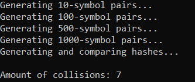
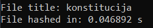
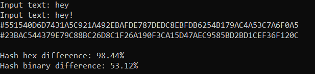
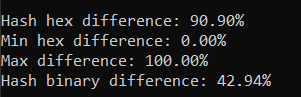

# 1-oji užduotis. Hash generatoriaus kūrimas.

## Hash funkcijos pseudokodas
    string hashfunc(string input, int n):
        string hex_val="";
        int tarp=0;                     // kintančios tarpinės reikšmės
        int a = int(input[0])/2; 
        while(hex_val.length()<64){     // ciklas kartojamas, kol pasiekiamas 64 simb. ilgis
            for(int i=0; i<n; ++i){                    
                tarp = (tarp + a + i)%256;             // naudojant tarpines reikšmes ir
                a += (int(input[i])%50);               // įvesties simbolių ascii kodus,
            }                                          // išgaunamos hash reikšmės.
            tarp = abs(tarp);                          // gauti skaičiai konvertuojami į hex sistemą
            hex_val += to_nBase(tarp, 16);             // ir pridedami prie hash išraiškos.
        }
        return hex_val;
## Naudojimasis programa
Paleidus programą, reikia pasirinkti, kurią funkciją ketinate atlikti:
* [1] Simple tests with data from files;
* [2] Search of collisions;
* [3] Individual input hashing;
* [4] Comparison of hashes from different inputs;
* [5] Test hash differences of 100'000 similar string pairs;

### [1] Paprasti testai su failais
Tikrinami šie pavyzdžiai:
* Lyginami du failai, sudaryti tik iš vieno, tačiau skirtingo, simbolio.

* Lyginami failai, sudaryti iš 1500 atsitiktinai sugeneruotų simbolių.

* Lyginami iš daug simbolių sudaryti failai, kuriuose skiriasi tik vienas simbolis.

* Tuščio failo hash'o generavimas.

### [2] *Kolizijų* paieška
Pagal užd. nurodytus reikalavimus sugeneruojamos 100'000 atsitiktinių simbolių eilučių porų.
Ieškoma ar tarp tų porų nėra vienodų maišos kodų. Kadangi maišos funkcija nėra labai efektyvi,
kaskart randamos 5-7 *kolizijos*. (Su atnaujinta maišos funkcija randamos 1-4 *kolizijos*)

### [3] Individualių input'ų hash'avimas
#### Failo `konstitucija.txt` hash'avimas

### [4] Dviejų skirtingų input'ų hash'ų palyginimas

### [5] Skirtingumo tikrinimas, lyginant 100'000 string'ų porų
Tikrinamas 100'000 simbolių eilučių porų, kurios skiriasi vienu simboliu, skirtingumas hex ir bitų lygmenyse.

## Funkcijos atitikimas reikalavimams
1. (+) Input gali būti bet kokio dydžio;
2. (+) Hash kodas visada tokio pat fiksuoto dydžio;
3. (+) Hash funkcija yra deterministinė (tam pačiam input'ui visada tas pats output'as);
4. (+) Hash reikšmė apskaičiuojama pakankamai efektyviai;
5. (+) Iš Hash kodo praktiškai neįmanoma atgaminti pradinės įvesties;
6. (-) Funkcija nėra atspari *kolizijoms*. 100'000 porų string'ų randamos bent kelios *kolizijos*;
7. (+) Tenkinamas *Avalanche* efektas (input'ą pakeitus minimaliai, Hash kodas pakinta iš esmės);