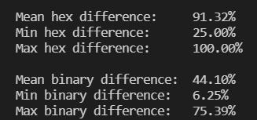

# 1-oji užduotis. Hash generatoriaus kūrimas. **v0.2**

## Hash funkcijos pseudokodas
    string hashfunc(string input, int n):
        string hex_val="";
        int tarp=0;                     // kintančios tarpinės reikšmės
        int a = int(input[0])/2; 
        while(hex_val.length()<64){     // ciklas kartojamas, kol pasiekiamas 64 simb. ilgis
            for(int i=0; i<n; ++i){                    
                tarp = (a + i*(n-i) + i)%256;          // maišos kodo elemento reikšmė priklauso
                a += (int(input[i]));                  // nuo įvesties simbolių sekos ir
            }                                          // jų ascii kodų.
            tarp = abs(tarp);                          // gautas skaičius konvertuojamas į hex sistemą
            hex_val += to_nBase(tarp, 16);             // ir pridedamas prie maišos kodo išraiškos.
        }
        return hex_val;
## Naudojimasis programa
Paleidus programą, reikia pasirinkti, kurią funkciją ketinate atlikti:
* [1] Simple tests with data from files;
* [2] Search of collisions;
* [3] Individual input hashing;
* [4] Comparison of hashes from different inputs;
* [5] Test hash differences of 100'000 similar string pairs;
* [6] Comparison with sha256 and md5;

### [1] Paprasti testai su failais
Tikrinami šie pavyzdžiai:
* Lyginami du failai, sudaryti tik iš vieno, tačiau skirtingo, simbolio.

* Lyginami failai, sudaryti iš 1500 atsitiktinai sugeneruotų simbolių.

* Lyginami iš daug simbolių sudaryti failai, kuriuose skiriasi tik vienas simbolis (konstitucija.txt ir konstitucija2.txt,
kurioje pakeistas vienas simbolis).

* Tuščio failo hash'o generavimas.

### [2] *Kolizijų* paieška
* Pagal užd. nurodytus reikalavimus sugeneruojamos 100'000 atsitiktinių simbolių eilučių porų.
Ieškoma ar tarp tų porų nėra vienodų maišos kodų. Kadangi maišos funkcija nėra labai efektyvi,
patikrinus **100'000** atsitiktinai sugenetuotų porų, paprastai randamos **0-2** *kolizijos*
(Ankstesnėje versijoje būdavo randamos **5-7** *kolizijos*).

### [3] Individualių input'ų hash'avimas
#### Failo `konstitucija.txt` hash'avimas

### [4] Dviejų skirtingų input'ų hash'ų palyginimas

### [5] Skirtingumo tikrinimas, lyginant 100'000 string'ų porų
* Tikrinamas 100'000 simbolių eilučių porų, kurios skiriasi vienu simboliu, vidutinis,
minimalus ir maksimalus skirtingumas hex ir bitų lygmenyse.  

### [6] Palyginimas su sha256 ir md5
* Tikrinamas to paties failo hash'avimo laikas (hash'uojamas failas - "Bitcoin and Cryptocurrency Technologies" knyga
nukopjuota į txt failą).

* Lyginamas sha256, md5 ir myHash funkcijų skirtingumas, generuojant 100'000 panašių simbolių eilučių porų.

## Funkcijos atitikimas reikalavimams
1. (+) Input gali būti bet kokio dydžio;
2. (+) Hash kodas visada tokio pat fiksuoto dydžio;
3. (+) Hash funkcija yra deterministinė (tam pačiam input'ui visada tas pats output'as);
4. (+/-) Hash reikšmė apskaičiuojama efektyviai;
5. (+) Iš Hash kodo praktiškai neįmanoma atgaminti pradinės įvesties;
6. (-) Funkcija yra atspari *kolizijoms*;
7. (+/-) Tenkinamas *Avalanche* efektas (input'ą pakeitus minimaliai, Hash kodas pakinta iš esmės);